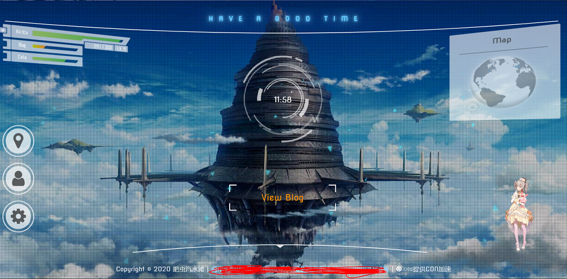

# SAOHomePage

## 预览

## 说明
一个仿SAOUtils的h5页面  适合用来做主页  
页面有点乱...  
网页预览 https://bugcola.com
## 相关
[parallax.js](http://matthew.wagerfield.com/parallax/)
[codepen](https://codepen.io/)  
[sao-utils](http://www.gpbeta.com/post/develop/sao-utils/)  
[F7wiki](https://f7d.huijiwiki.com/wiki/%E9%A6%96%E9%A1%B5)  
[fontawesome](https://fontawesome.com/)  
[桌面时钟挂件](https://tieba.baidu.com/p/5247505848?red_tag=0002828173) 
